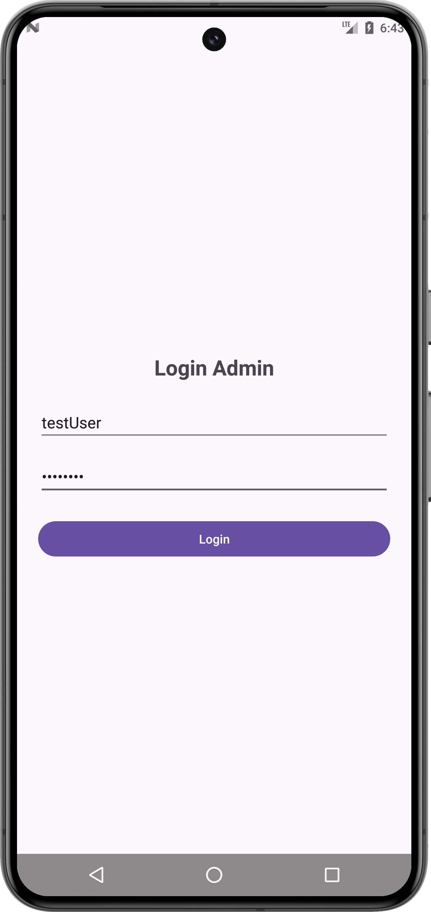
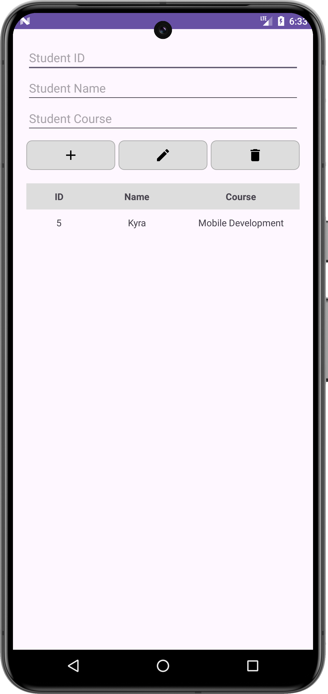

# college-android-login-SQLite
This is first loginApp using SQLite, This project is a task come from college task

**Primary Language**: Java

## Overview

LoginApp is an Android application designed as part of a college project. The app utilizes SQLite for local data storage and focuses primarily on user authentication and student management. Currently, the application includes a functional login feature and the ability to add students. Additional features are under development.

## Screenshots

  
*Login Screen*

  
*Dashboard Screen*

## Features

- **User Login**: Users can log in to the application using their credentials.
- **Add Student**: Users can add student details to the database.

## Technologies Used

- **Android Studio**: Integrated Development Environment (IDE) for Android app development.
- **Java**: Programming language used for developing the application.
- **XML**: Markup language for designing user interfaces.
- **SQLite**: Lightweight database used for local data storage.

## Code Structure

- **Java**: Contains the logic for handling login validation and volume calculation.
  - `LoginActivity.java`: Handles user login.
  - `DashboardActivity.java`: Contains the code for logic add Student, update Student and delete Student(Only add Student logic works for now).
  - `DatabaseHelper.java`: Contains the code for CRUD logic on SQlite.
  -    
- **XML**: Defines the UI layout.
  - `activity_main.xml`: Layout for the login screen.
  - `activity_dashboard.xml`: Layout for the Dashboard, contains user input to add data, update data, delete data.
  - `student_list_item.xml` : Layout for the list of student and course data.

## Getting Started

### Prerequisites
- **Android Studio**: Ensure Android Studio is installed and for me, i'm using Android Studio Koala | 2024.1.1 Patch 2.
- **Java Development Kit (JDK)**: Version 8 or above and for me, i'm using Version 17.0.11.

## Installation

**Clone the repository**:
1. Clone this repository to your local machine.
   ```bash
   git clone https://github.com/yourusername/loginApp.git
   
Replace `yourusername/your-repo-name` in the `git clone` command with your actual GitHub repository name, and update any screenshot paths if you add them. This README covers the project's main details and provides context for users or reviewers.

2. Launch Android Studio and select "Open an existing Android Studio project".
3. Navigate to the cloned repository folder and open it.
4. Build the project: Click on "Build" in the top menu and select "Make Project".
5. Connect an Android device or start an emulator.
6. Click on the "Run" button in Android Studio.
7. Username: testUser Password: testPass
